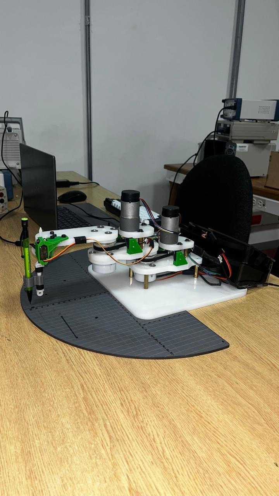

# 🤖 SCARA Robot — Design and Implementation

> Integrative project for **Industrial Robotics** and **Digital Control**  
> Mechatronics Engineering — 8th Semester - EIA University · 2024

---

## 📌 Overview

This repository documents the design, fabrication, and implementation of a **3-DOF SCARA robot (RRP)**: two rotary joints and one prismatic joint. The project was conceived as an automation solution for **TIG welding** tasks, integrating mechanical design, embedded electronics, digital control, and robot kinematics.

The robot is capable of executing a *home* routine, moving to arbitrary points within its workspace, and autonomously following linear and semicircular trajectories.

| | |
|---|---|
|  |  |
| CAD | Assembled |

| | |
|---|---|
| **Robot type** | SCARA — RRP (3 DOF) |
| **Target application** | Automated TIG welding |
| **Microcontroller** | Raspberry Pi Pico (MicroPython) |
| **Actuators** | 2× Pololu DC 200 RPM + encoder · 1× MG90S Servo |
| **Year** | 2024 |

---

## 👥 Team

- Mariana Calle Méndez  
- Felipe Jesús Mercado  
- Alejandro Hoyos Chaves  
- Alejandro Blandón Sánchez  

---

## 📁 Repository Structure

```
scara-robot-rrp/
│
├── README.md
├── LICENSE
├── .gitignore
│
├── mechanical/
│   ├── inventor/          # .ipt and .iam files (Autodesk Inventor)
│   ├── stl/               # STL files for 3D printing
│   ├── drawings/          # Technical drawings (PDF / DWG)
│   └── bom.xlsx           # Mechanical bill of materials
│
├── electronics/
│   ├── kicad/             # Full KiCad project
│   ├── gerbers/           # Gerber files for PCB fabrication
│   ├── schematic.pdf      # Exported schematic
│   └── bom_electronics.csv
│
├── firmware/
│   ├── main.py            # Main entry point
│   ├── motors/            # Pololu motor + encoder control
│   ├── servo/             # Servo motor + rack-and-pinion control
│   ├── kinematics/
│   │   ├── forward.py     # Forward kinematics
│   │   ├── inverse.py     # Inverse kinematics
│   │   └── trajectories.py
│   └── config.py          # DH parameters, joint limits, etc.
│
├── control/
│   ├── matlab/            # Simulation and tuning scripts (MATLAB)
│   ├── identification/    # System identification (reaction curve)
│   └── controllers/       # Controller results and coefficients
│
├── docs/
│   ├── dh_parameters.md   # Denavit-Hartenberg parameter table
│   ├── kinematics.md      # Forward and inverse kinematics derivation
│   ├── control_design.md  # Controller design and analysis
│   ├── web/               # Integrated content from project website by section
│   └── wiring_diagram.pdf # Wiring diagram
│
└── media/
    ├── images/            # Photos of the physical robot and web source evidence
    │   └── web/           # Downloaded figures from project website
    └── videos/            # Trajectory demos and final presentation
```

---

## ⚙️ Mechanical Design

The robot was designed in **Autodesk Inventor** and consists of:

- **Joint 1 (R):** Rotary — Pololu DC motor 200 RPM with encoder
- **Joint 2 (R):** Rotary — Pololu DC motor 200 RPM with encoder
- **Joint 3 (P):** Prismatic — MG90S servo motor with rack-and-pinion mechanism (tool holder / TIG torch)

Parts were manufactured at the **metalworking laboratory** using:
- CNC milling and turning
- FDM 3D printing for complex geometry components

---

## 🔌 Hardware & Electronics

A **custom PCB was designed in KiCad**, integrating all power and signal components required for robot operation.

### Main components

| Component | Description |
|---|---|
| Raspberry Pi Pico | Main microcontroller (RP2040) |
| 2× Pololu DC Motor | 200 RPM, 12V, quadrature encoder |
| MG90S Servo | PWM control — Z axis (rack and pinion) |
| L298N | H-bridge motor driver |
| Limit switches | Travel limits and home routine |
| Custom PCB | Designed in KiCad |

Motor supply was set to **12V**, ensuring smooth operation within the optimal range per the Pololu actuator datasheet.

---

## 💻 Firmware

Written in **MicroPython** on the Raspberry Pi Pico. The firmware handles:

- Quadrature encoder reading via interrupts
- Servo PWM control
- Real-time inverse kinematics execution
- Trajectory generation and following
- Homing routine with limit switches
- Serial terminal command interface

### Available commands

| Command | Function |
|---|---|
| `P` | Move to a point (x, y, z) in the workspace |
| `L` | Execute a linear trajectory |
| `C` | Execute a semicircular trajectory |

> ⚠️ **Note:** Being an interpreted language without RTOS support, MicroPython showed timing precision limitations for real-time tasks. Migration to C/C++ is recommended for future versions.

---

## 🌐 Web Integration (2026)

Website content was integrated and organized in `docs/web/` to preserve section-level traceability:

- `docs/web/manufactura.md`
- `docs/web/hardware.md`
- `docs/web/firmware.md`
- `docs/web/instrumentacion.md`
- `docs/web/control.md`
- `docs/web/resultados.md`
- `docs/web/calculos_y_hitos.md`

Supporting image evidence from the website is available in `media/images/web/`.

---

## 📐 Kinematics

### Denavit-Hartenberg Parameters

| Link | θᵢ | dᵢ | aᵢ | αᵢ |
|---|---|---|---|---|
| 1 | θ₁* | 0 | L₁ | 0 |
| 2 | θ₂* | 0 | L₂ | 0 |
| 3 | 0 | d₃* | 0 | 0 |

*Joint variable

### Inverse Kinematics

The analytical solution computes joint angles (θ₁, θ₂) and linear displacement (d₃) from a desired Cartesian position (x, y, z) in the workspace.

---

## 🎛️ Digital Control

Controllers were designed in **MATLAB** using three methodologies:

1. **Reaction Curve** — System identification and empirical tuning
2. **Ultimate Gain (Ziegler-Nichols)** — Based on the system's critical gain
3. **Pole Placement** — Design by pole location in the Z-plane

For each method, controllers were designed for both **angular velocity** and **angular position**, and evaluated through:

- Closed-loop step response
- Stability analysis on the unit circle
- Discrete-time Root Locus
- Gain and phase margins (discrete Bode diagram)

### Selected controllers

| Variable | Controller | Method |
|---|---|---|
| Angular velocity | **PI** | Pole Placement |
| Angular position | **PD** | Pole Placement |

Selection was based on strict relative stability criteria: controllers with poles near or outside the unit circle, or with insufficient gain/phase margins, were discarded.

---

## 📊 Results

- ✅ Functional home routine with limit switches
- ✅ Point-to-point positioning within the workspace
- ✅ Linear trajectory implemented and validated
- ✅ Semicircular trajectory implemented and validated
- ✅ Small position errors and good repeatability

### Key conclusions

- A solid mechanical design is critical: it reduces backlash, simplifies control, and improves end-effector precision.
- Encoder noise was the main electronics challenge. A moving average filter was implemented, though its performance was limited.
- MicroPython was functional for the prototype, but its timing limitations are evident in high-precision applications.

---

## 🔮 Future Work

- [ ] Migrate firmware to **C/C++** (compiled language, better real-time performance)
- [ ] Implement a **digital low-pass filter** for encoder reading
- [ ] Add **higher gear ratios** to improve position control resolution
- [ ] Integrate a graphical interface for trajectory programming
- [ ] Validate with a real TIG torch for automated welding

---

## 🛠️ Tools Used

| Area | Tool |
|---|---|
| Mechanical design | Autodesk Inventor |
| PCB design | KiCad |
| Programming | MicroPython (Raspberry Pi Pico) |
| Simulation & control | MATLAB / Simulink |
| Manufacturing | CNC · FDM 3D Printing |

---

## 📄 License

This project was developed for academic purposes. See the [LICENSE](LICENSE) file for details.

---

> 🌐 Project website: [alejoblandon22.wixsite.com/robot-scara](https://alejoblandon22.wixsite.com/robot-scara)
